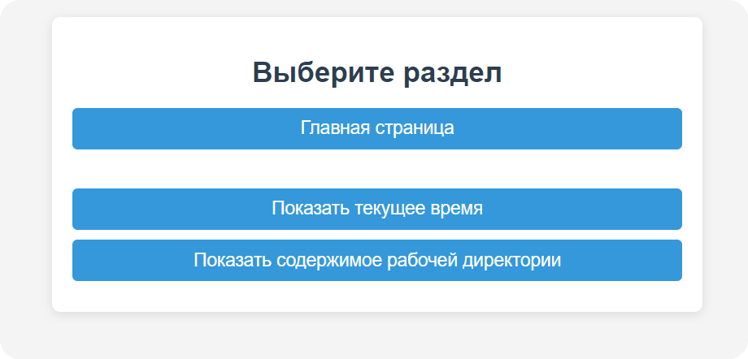

## Описание
Проект на Django с тремя функциями:
1. **Домашняя страница**: Список доступных страниц.
2. **Текущее время**: Показывает текущее время.
3. **Рабочая директория**: Содержимое текущей директории.



## Установка
1. Установите зависимости:
   ```bash
   pip install -r requirements.txt
   ```
2. Запустите проект python в 1.1-first-project/first_project
```manage.py runserver```
   